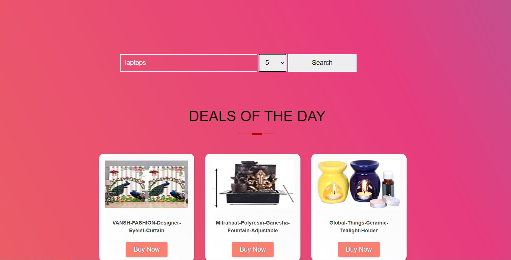
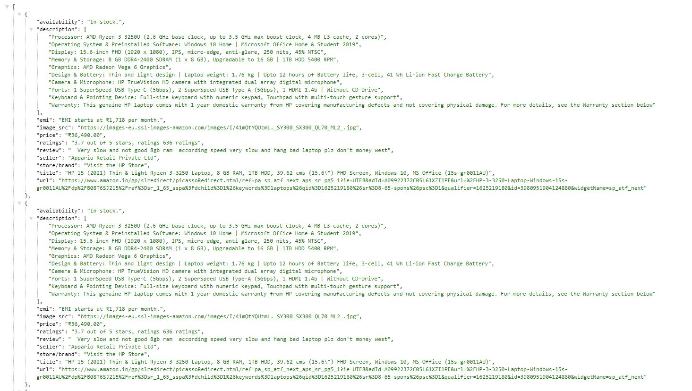
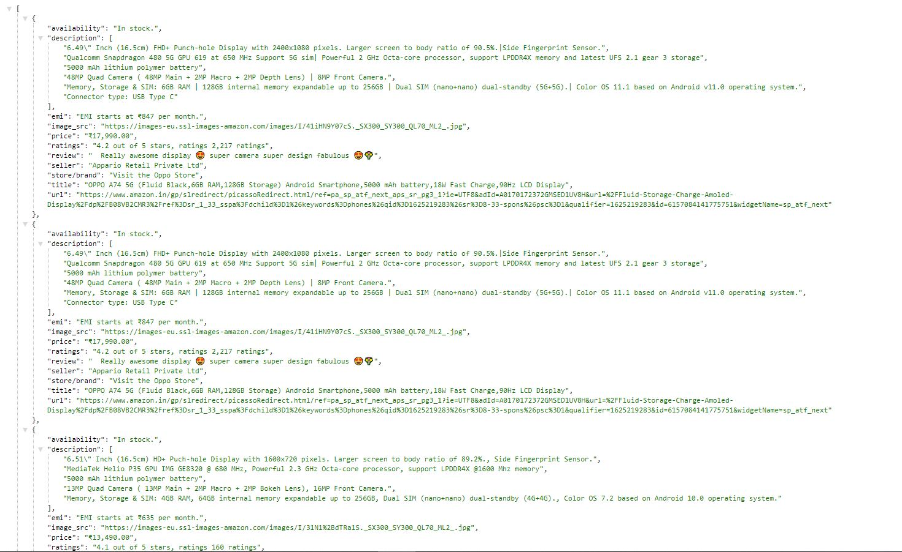

# Advanced scraper(bs4) integrated with flask and pagination support

It is a combination of requests, bs4 and flask that crawls the source and provides some descriptive details of a product. Pre-defined html template is used for displaying the content of home page i.e. best deals. Details are:

- Title
- Brand
- Price
- Emi
- Availability
- Seller's Name
- Description
- Ratings
- Image source
- Top rating
- Url (to visit)

`NOTE: As the source for now is only amazon.in, so it will work only for any e-commerce product available/listed on amazon`


## Installation

- Make sure you have python(version>=2.7) installed in your system.

- Install the requirements.txt file.

```bash
pip install -r requirements.txt
```

- You are ready to start. To activate flask server locally, run

```
python app.py
```


## How to Query?

- Running the above flask command `python app.py` will provide your local flask server.
(local host example: http://127.0.0.1:5000/) or something like this...

- Copy and paste the local host to your browser to visit the home page and start searching for a item.

##### OR

- Path defined to search a query is as follows:

```
http://127.0.0.1:8000/search?query=laptops&page=1
```

- It requires two arguments `query` & `page`. Query refers to the item you wanted to search for and page simply refers to desired integer.
(Each page contains list of 15 items in output). Defaults setted to 1.

- Output will be displayed in JSON format. For a prettier visibility, add extension/install any JSON formattor. 
Recommended [here](https://chrome.google.com/webstore/detail/json-formatter/bcjindcccaagfpapjjmafapmmgkkhgoa).

`NOTE: As the source for now is only amazon.in, so it will work only for any e-commerce product available/listed on amazon`


## Workflow

- Complete the installation process, and visit the home page.

- It reads your query from search bar and pages from option tag.

- Parses it to a function that goes to each of the products individual urls and extract th required/available informations

- Returns all the infomation in a JSON format (limited to 15 items).


## Images



<br>



<br>

### Thank you so much for your precious time!!
## Always feel free to contribute or suggest some features/bugs :)